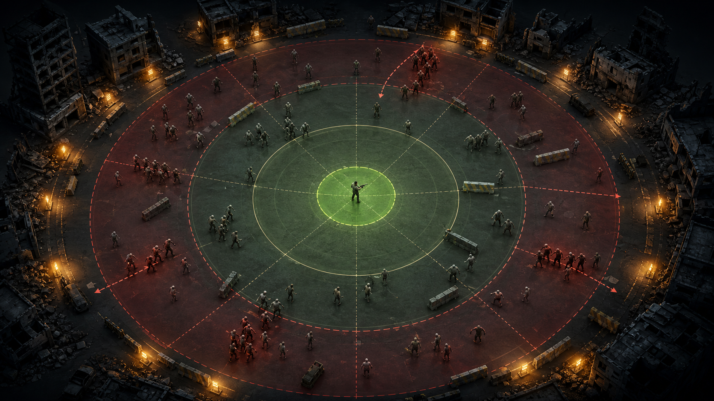
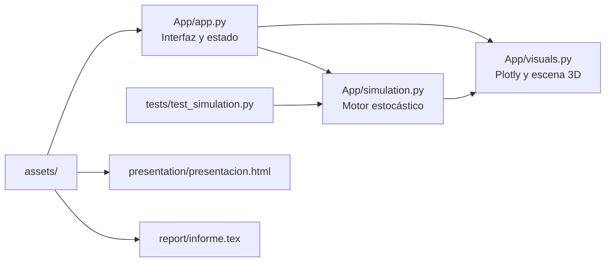

<p align="center">
  
</p>

<h1 align="center">OUTBREAK: Stochastic Survival Lab</h1>

<p align="center">
  Simulación interactiva de un apocalipsis zombi mediante procesos estocásticos,<br>
  Monte Carlo y visualización tridimensional en Streamlit.
</p>

<p align="center">
  
  
  
  
  
</p>

---

## Navegación

| Sección | Contenido |
|---|---|
| [Descripción](#descripción-general) | Propósito, pregunta y alcance del proyecto |
| [Modelo matemático](#modelo-matemático) | Poisson y alternativa Polar-lognormal |
| [Motor de simulación](#motor-de-simulación) | Reglas, variables y parámetros |
| [Experimentos](#experimentos-estadísticos) | Monte Carlo, comparación pareada y curva de supervivencia |
| [Arquitectura](#arquitectura-del-proyecto) | Organización y responsabilidades del código |
| [Ejecución](#inicio-rápido) | Instalación y comandos correctos para la nueva estructura |
| [Entregables](#entregables-académicos) | Presentación HTML e informe LaTeX |
| [Pruebas](#pruebas-automatizadas) | Validación determinista y estadística |

## Descripción general

Este proyecto académico de **Modelación y Simulación** representa una misión de
supervivencia ante infectados. El sistema genera los instantes de aparición,
simula movimiento y combate, y estima la probabilidad de que el protagonista
permanezca con vida hasta el final del horizonte temporal.

La investigación se apoya en cuatro pilares:

| Pilar | Implementación |
|---|---|
| Modelación probabilística | Proceso de Poisson e interarribos exponenciales |
| Modelo de contraste | Proceso de renovación lognormal generado con Marsaglia polar |
| Simulación computacional | Motor discreto con paso temporal configurable |
| Inferencia y comunicación | Monte Carlo, intervalo de Wilson, gráficas y escena 3D |

> **Pregunta central:** ¿cómo cambia la supervivencia cuando aumenta la tasa de
> llegadas o cuando cambia la distribución de los tiempos entre llegadas?

El objetivo no es afirmar que *Polar* sea otro proceso de conteo equivalente.
Poisson es el modelo probabilístico principal; el método polar es el algoritmo
empleado para generar normales que, después de una transformación lognormal,
producen una alternativa con interarribos positivos y diferente variabilidad.

<p align="center">
  
</p>

## Modelo matemático

### 1. Proceso de Poisson homogéneo

Sea $N(t)$ el número de infectados que aparecen hasta el instante $t$. Para una
tasa constante $\lambda$:

$$
N(t)\sim\operatorname{Poisson}(\lambda t),
\qquad
P\{N(t)=k\}=e^{-\lambda t}\frac{(\lambda t)^k}{k!}.
$$

Por tanto:

$$
\mathbb E[N(t)]=\operatorname{Var}[N(t)]=\lambda t.
$$

Los tiempos entre llegadas son variables aleatorias continuas exponenciales.
Se generan mediante transformada inversa:

$$
U_i\sim U(0,1),
\qquad
\Delta_i=-\frac{\ln(U_i)}{\lambda}.
$$

Esta formulación garantiza interarribos positivos, independientes y con media
$1/\lambda$.

### 2. Alternativa Polar-lognormal

El método polar de Marsaglia genera normales estándar a partir de uniformes. Se
toman $V_1,V_2\sim U(-1,1)$, se calcula $S=V_1^2+V_2^2$ y se acepta el par solo
cuando $0<S<1$:

$$
Z=V_1\sqrt{\frac{-2\ln(S)}{S}}\sim N(0,1).
$$

Como una normal puede ser negativa, no se utiliza directamente como tiempo. En
su lugar se construye el interarribo positivo:

$$
\Delta_i=e^{\mu+\sigma Z_i}.
$$

Si $c$ es el coeficiente de variación deseado:

$$
\sigma^2=\ln(1+c^2),
\qquad
\mu=\ln(1/\lambda)-\frac{\sigma^2}{2}.
$$

Así, $\mathbb E[\Delta]=1/\lambda$. Ambos modelos conservan la misma frecuencia
media, pero difieren en memoria, dispersión y formación de rachas.

### 3. Construcción de los instantes de llegada

En ambos casos los tiempos absolutos se obtienen acumulando interarribos:

$$
t_0=0,
\qquad
t_i=t_{i-1}+\Delta_i.
$$

| Propiedad | Poisson-exponencial | Polar-lognormal |
|---|---|---|
| Tipo de modelo | Proceso de conteo homogéneo | Proceso de renovación |
| Soporte del interarribo | $(0,\infty)$ | $(0,\infty)$ |
| Media configurada | $1/\lambda$ | $1/\lambda$ |
| Falta de memoria | Sí | No |
| Variabilidad | CV igual a 1 | CV configurable |
| Función en el proyecto | Modelo principal | Contraste experimental |

## Motor de simulación

La partida se aproxima mediante un paso fijo $dt$. En cada iteración se activan
las llegadas programadas, los infectados avanzan radialmente, el protagonista
elige al objetivo vivo más cercano dentro de su alcance y se aplican los daños.

### Reglas operativas

1. El protagonista permanece en el centro de una arena circular.
2. Los infectados aparecen cerca del perímetro y avanzan hacia el centro.
3. El protagonista ataca un solo objetivo a la vez dentro del alcance.
4. Todos los infectados en contacto pueden infligir daño concurrentemente.
5. La misión termina en victoria al alcanzar la duración con HP positivo.
6. La misión termina en derrota cuando el HP llega a cero.

Los atributos enemigos tienen variaciones uniformes acotadas. Las fuentes
aleatorias de llegadas y atributos están separadas para que, con una misma
semilla, el enemigo de igual índice conserve atributos equivalentes al comparar
modelos.

### Parámetros iniciales

| Parámetro | Unidad | Valor | Interpretación |
|---|---:|---:|---|
| Duración | s | 90 | Horizonte de la misión |
| Tasa | llegadas/min | 39 | Equivale a $\lambda=0.65$ por segundo |
| CV Polar | adimensional | 0.45 | Variabilidad lognormal |
| HP del protagonista | HP | 110 | Vida inicial disponible |
| DPS del protagonista | HP/s | 42 | Capacidad ofensiva |
| Alcance | m | 10 | Radio efectivo del ataque |
| HP infectado | HP | 42 | Resistencia base |
| Velocidad infectado | m/s | 1.55 | Avance radial base |
| DPS infectado | HP/s | 9 | Daño base al contactar |
| Paso temporal | s | 0.05 | Resolución numérica |

La interfaz muestra las unidades y evita configuraciones geométricas inválidas.
El motor vuelve a validar positivos, radios, precisión y límites antes de iniciar
una corrida.

## Experimentos estadísticos

### Estimación Monte Carlo

Para $R$ partidas independientes:

$$
\widehat p=\frac{1}{R}\sum_{r=1}^{R}I_r,
$$

donde $I_r=1$ si la partida termina con supervivencia. Además del estimador
puntual, la aplicación reporta un **intervalo de Wilson al 95 %**, más estable
que la aproximación normal cuando la proporción está cerca de 0 o 1.

### Comparación pareada

Poisson y Polar-lognormal se ejecutan con las mismas semillas por corrida. Este
diseño pareado reduce la variación provocada por atributos enemigos y permite
atribuir con mayor claridad las diferencias al patrón de llegadas.

### Curva de supervivencia

La interfaz también evalúa múltiples tasas. El resultado permite observar la
relación entre presión de llegadas, intervalos de confianza y probabilidad de
completar la misión.

## Interfaz y visualización 3D

La escena utiliza `plotly.graph_objects.Mesh3d`. Los personajes y objetos se
construyen proceduralmente con mallas de bajo poligonaje; el escenario incluye
terreno, ruinas, vehículos, barricadas y anillos tácticos. Puede rotarse,
acercarse y explorarse a través del tiempo directamente en el navegador.

Pygame no se integró porque su abstracción principal es una superficie 2D con
un bucle de eventos de escritorio; para 3D requiere una capa adicional como
OpenGL y no se incorpora naturalmente al ciclo reactivo de Streamlit. La
[documentación de Pygame](https://www.pygame.org/docs/) describe este enfoque.

Para una aplicación de escritorio independiente,
[Panda3D](https://docs.panda3d.org/1.10/python/introduction/index) sí ofrece un
motor 3D completo. En esta entrega se priorizó la integración web, estadística e
interactiva. Plotly documenta la construcción de triángulos con `i`, `j` y `k`
en [3D Mesh Plots](https://plotly.com/python/3d-mesh/).

## Arquitectura del proyecto



```text
Proyecto-1_Grupo-1_Modelacion-y-Simulacion_Sec-30/
|-- README.md
|-- LICENSE
`-- zombie_poisson_streamlit/
    |-- .streamlit/
    |   `-- config.toml
    |-- App/
    |   |-- app.py
    |   |-- simulation.py
    |   `-- visuals.py
    |-- assets/
    |   |-- outbreak-command-center.png
    |   `-- outbreak-tactical-model.png
    |-- presentation/
    |   `-- presentacion.html
    |-- report/
    |   |-- informe.tex
    |   `-- informe.pdf
    |-- requirements/
    |   `-- requirements.txt
    |-- tests/
    |   `-- test_simulation.py
    `-- .gitignore
```

| Archivo | Responsabilidad |
|---|---|
| [`App/simulation.py`](zombie_poisson_streamlit/App/simulation.py) | Generadores, combate, Monte Carlo e intervalos |
| [`App/visuals.py`](zombie_poisson_streamlit/App/visuals.py) | Escena 3D y gráficas estadísticas |
| [`App/app.py`](zombie_poisson_streamlit/App/app.py) | Formularios, estado, resultados y teoría |
| [`tests/test_simulation.py`](zombie_poisson_streamlit/tests/test_simulation.py) | Pruebas deterministas y estadísticas |
| [`report/informe.tex`](zombie_poisson_streamlit/report/informe.tex) | Informe académico reproducible |
| [`presentation/presentacion.html`](zombie_poisson_streamlit/presentation/presentacion.html) | Exposición navegable en el navegador |

Las imágenes de `assets/` se generaron específicamente para este proyecto con
una herramienta de generación de imágenes de OpenAI. No contienen marcas ni
material de una franquicia reconocible.

## Inicio rápido

> Todos los comandos siguientes parten de la carpeta
> `zombie_poisson_streamlit`. Esto también permite que Streamlit detecte
> automáticamente `.streamlit/config.toml`.

### Windows PowerShell

```powershell
cd .\zombie_poisson_streamlit
python -m venv .venv
.\.venv\Scripts\Activate.ps1
python -m pip install --upgrade pip
python -m pip install -r .\requirements\requirements.txt
python -m streamlit run .\App\app.py
```

### Linux, WSL o macOS

```bash
cd zombie_poisson_streamlit
python3 -m venv .venv
source .venv/bin/activate
python -m pip install --upgrade pip
python -m pip install -r requirements/requirements.txt
python -m streamlit run App/app.py
```

La aplicación se abre normalmente en <http://localhost:8501>. Después de la
primera instalación basta con activar el entorno y ejecutar el último comando.

### Flujo recomendado de uso

1. Elegir el modelo de llegadas y configurar la tasa por minuto.
2. Revisar los atributos de combate, geometría y semilla.
3. Pulsar **SIMULAR MISIÓN**.
4. Recorrer el tiempo y explorar la escena 3D.
5. Revisar variables generadas y desarrollo matemático.
6. Ejecutar la comparación pareada Poisson--Polar.
7. Ejecutar Monte Carlo y analizar el intervalo de confianza.

## Pruebas automatizadas

Desde `zombie_poisson_streamlit`:

```powershell
python -m unittest discover -s .\tests -v
```

En sistemas tipo Unix el comando equivalente es:

```bash
python -m unittest discover -s tests -v
```

Las pruebas cubren reproducibilidad, media y varianza del conteo Poisson, media
lognormal, consistencia posterior a una derrota, validación geométrica,
emparejamiento de semillas y estabilidad respecto de $dt$.

## Entregables académicos

### Presentación HTML

El archivo [`presentacion.html`](zombie_poisson_streamlit/presentation/presentacion.html)
es autocontenido salvo por las imágenes compartidas de `assets/`. Para abrirlo
desde `zombie_poisson_streamlit` en Windows:

```powershell
Start-Process .\presentation\presentacion.html
```

Use las flechas izquierda/derecha, `Page Up`, `Page Down`, la barra espaciadora
o los controles en pantalla para navegar.

### Informe LaTeX

El informe resuelve sus imágenes respecto de la carpeta `report/`. Compile desde
allí para conservar las rutas correctas:

```powershell
cd .\report
pdflatex informe.tex
pdflatex informe.tex
```

La segunda ejecución actualiza referencias y tabla de contenido. El PDF ya
generado está disponible en
[`report/informe.pdf`](zombie_poisson_streamlit/report/informe.pdf).

## Supuestos y limitaciones

- La tasa permanece constante dentro de cada partida.
- Los infectados no colisionan ni evitan obstáculos; las ruinas son visuales.
- El protagonista no se desplaza y enfoca un objetivo a la vez.
- El combate es una aproximación de tiempo discreto.
- La curva de supervivencia es una estimación Monte Carlo, no una solución
  analítica exacta.
- Un histograma de una sola partida puede estar sesgado por el horizonte de
  observación y se usa únicamente como diagnóstico visual.
- Poisson es apropiado cuando tasa constante, independencia y falta de memoria
  son supuestos razonables; no es universalmente superior a cualquier proceso.

## Conclusión esperada

Poisson es la opción principal por su interpretación, parsimonia y relación
directa entre conteos e interarribos exponenciales. El modelo Polar-lognormal es
un contraste útil: evidencia que mantener la misma tasa media no conserva las
rachas, la concurrencia ni la probabilidad de supervivencia. La conclusión final
debe sustentarse en los resultados e intervalos obtenidos en cada ejecución.

## Licencia

Distribuido bajo la licencia indicada en [`LICENSE`](LICENSE).
